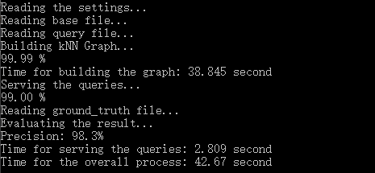
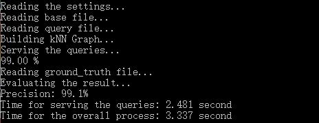
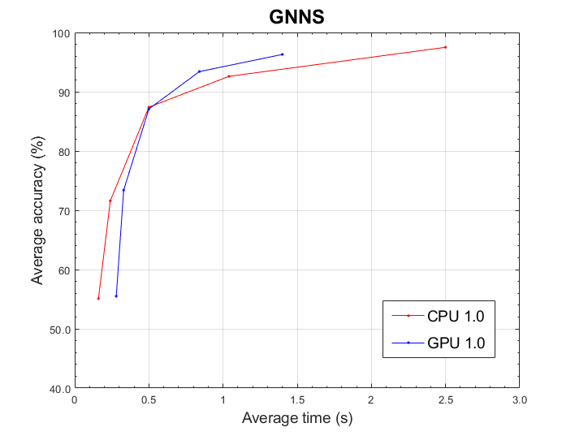

GNNS
========
GNNS is a project implementing a ***fast*** and ***efficient*** approximate nearest-neighbor search algorithm with k-nearest neighbor graph, which is proposed in the paper [Fast Approximate Nearest Neighbor Search With The Navigating Spreading-out Graph](https://arxiv.org/abs/1707.00143).

***Two*** versions of code are included. One is pure C++ code which is designed to use the computing power of ***CPU*** in PC, while the other is an integration of CUDA and C++ code that can make use of the computing resources via ***GPU***.

Benchmark Data Set
----
* [SIFT1M and GIST1M](http://corpus-texmex.irisa.fr/)

How to Use
----
+ Build by Microsoft Visual Studio after openning project file. `./cpu/1.0/1.0.vcxproj` for CPU version and `./gpu/1.0/1.0.vcxproj` for GPU version.

+ If you want to run the GPU version, make sure you are capable of running CUDA code. `./gpu/test/test.vcxproj` can help you figure out the significant information of your GPU device.

+ Download data files and place them where you want. Then modify the corresponding information in `config.txt` in the root directory of your project to specify the file paths. Also modify the parameters of the algorithm in `config.txt`.
For example, a configuration may look like
```
Path for base file:../../data/sift/siftsmall/siftsmall_base.fvecs

Path for query file:../../data/sift/siftsmall/siftsmall_query.fvecs

Path for ground truth file:../../data/sift/siftsmall/siftsmall_groundtruth.ivecs

Path for kNN graph file(if exist):./bin/graph

k for k-NN graph (k):1000

Number of required nearest neighbors (K):10

Number of ramdon starts (R):4

Number of greedy steps (T):8

Number of expansions (E < k):1000
``` 
where the meaning of the parameters accord with the ones specified in the article.

+ Running on some GPUs will fails with a small TDR delay. You might need to change the delay of your device. Learn more in the [user guide](http://docs.nvidia.com/nsight-visual-studio-edition/Nsight_Visual_Studio_Edition_User_Guide.htm#Timeout_Detection_Recovery.htm%3FTocPath%3DReference%7C_____2).

+ If everything goes well, running results may look like
<p></p>

if you run the project for the first time and have to construct a kNN graph from scratch, or like
<p></p>

if you have already constructed a kNN graph in previous attempts.

+ May you enjoy the experience with the project.

Performance
----
The performance was tested using data files in directory *siftsmall* of the data set mentioned above.

<p></p>

where R takes the value 1, 2, 4, 8, 16, and k, K, T, E are fixed to be 1000, 10, 8, 200, respectively.

You are welcome to experiment on your own to examine the program.


